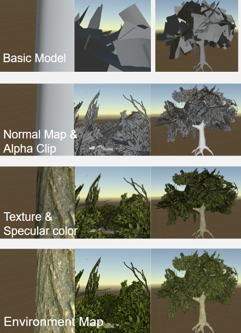
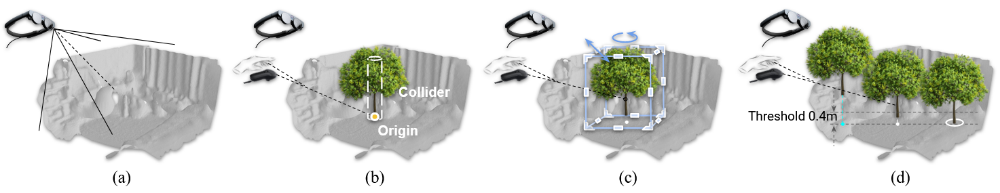

# Mixed-Reality Tree Rendering
This project showcases an interactive Argumented Reality application in Unity designed for the Magic Leap device, featuring realistic tree rendering enhanced by dynamic wind and lighting simulations. By integrating simple physical models, it creates an immersive AR experience in which the user can place a variety of tree models into their environment. 
[Read the full report: ](assets/Rendering_Trees_in_Augmented_Reality.pdf)

